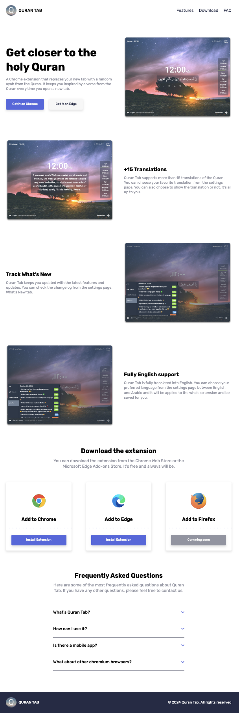

# Browser Extension Landing Page
This project is a well-designed, user-friendly landing page for a browser extension available on both Chrome and Edge. It provides users with essential information about the extension, including its features and installation instructions. The design is responsive and modern, utilizing HTML and CSS Flexbox for layout and smooth animations for an engaging user experience.
## Features

- Responsive Design: Optimized for various screen sizes and devices using CSS Grid and Flexbox.
- Modern Layouts: Leveraged CSS Grid and Flexbox to create complex and adaptive layouts.
- CSS Animations: Smooth and engaging animations to enhance user experience.

## Technologies Used

- **HTML5:** Markup language for creating the structure of the web pages.
- **CSS3:** Styling the components with advanced techniques (Flexbox, CSS Grid).
- **SASS:** enhance the development process and make stylesheets more maintainable

## Screenshot

## Acknowledgements
- **Almadrsa Diploma:** For providing comprehensive front-end development training.
- **Course Instructors:** For their valuable guidance and support.
- **Community & Open Source:** For the tools and libraries that made this project possible.

## License
This project is licensed under the MIT License - see the [LICENSE](/LICENSE) file for details.

## Author
- Linkedin - [@selahb-ahmed-yakoub](https://www.linkedin.com/in/selhab-ahmed-yakoub/)
